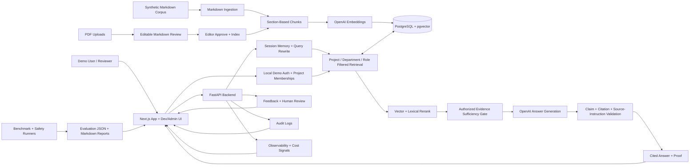

# Proofbase: Permission-Aware Enterprise RAG

**Proofbase** is a full-stack enterprise RAG portfolio application. It organizes internal knowledge into project and department workspaces, filters evidence by role before generation, and returns cited answers with visible retrieval, confidence, latency, evaluation, and audit proof.

## At A Glance

| Area | What is implemented |
| --- | --- |
| Product | Project workspaces, owner-managed demo access, department document libraries, scoped chat, PDF-to-Markdown review, optional AI cleanup, and explicit approve/index. |
| RAG | PostgreSQL/pgvector, keyword search, vector + lexical reranking, multi-source planning, evidence sufficiency, structured response types, post-generation claim validation, citations, and confidence signals. |
| Security | Public Trust & Safety status page, local OIDC/tenant and database-policy boundaries, distributed abuse controls, tenant PDF quarantine, mounted-secret boundary, privacy-safe logs, role-filtered retrieval, defensive generation checks, and permission audits. |
| Evaluation | 130-question regression benchmark, three independently sealed holdouts, human adjudication, failure matrices, cost tracking, and durable exactly-once-oriented execution evidence. |
| Operations | Feedback, observability, audit logs, health/readiness endpoints, Docker Compose, CI, and Azure-ready deployment documentation. |

## Evidence Snapshot

| Evidence | Current result | Interpretation |
| --- | ---: | --- |
| Known benchmark regression | `130/130` | Strong regression result; not unseen-generalization proof. |
| Phase 49 fresh holdout | `22/30` | Valid one-time automated result; missed the `27/30` claim target. |
| Holdout behavior / source recall | `0.967` / `0.982` | Both predeclared gates passed. |
| Holdout completeness / citation accuracy | `0.875` / `0.947` | Both predeclared gates passed. |
| Holdout heuristic hallucination | `0.133` | Missed the `<=0.05` gate; human review found all four automated flags were evaluator false positives, plus one separate unflagged factual error. |
| Fresh-holdout safety | `0` violations | No permission leakage, restricted citations, unauthorized generation, or memory-as-evidence violations. |
| Evaluation reliability | `30/30` durable rows | 62 verified journal events, one attempt per case, and no duplicate external calls. |

Human review classified the eight Phase 49 automated failures as four evaluator-only, three product, and one mixed. The automated `22/30` remains official; no human-adjusted score or generalization-improvement claim is published.

## What This Demonstrates

- A usable App side: projects, departments, document review, scoped assistant workflows, and answer proof.
- A serious Dev/Admin side: evaluation runs, failed cases, permissions, memory, feedback, observability, audit, and algorithm comparison.
- Permission filtering before generation, with zero leakage across the latest fresh holdout.
- Benchmark-driven iteration without presenting tuned regression scores as unseen performance.
- Independent holdout authoring, immutable one-time runs, human adjudication, and durable recovery-aware evaluation infrastructure.
- Honest boundaries: synthetic/non-sensitive upload data, local fixture scanning and subprocess parsing, local demo auth, heuristic metrics, and no production deployment claim.

## Five-Minute Review Path

1. Open `/projects` and select the seeded **Northstar Analytics** workspace.
2. Inspect a department document library and its indexed Markdown or upload review flow.
3. Ask a scoped question in `/chat` and open **Why this answer?** for citations, scope, confidence, latency, and retrieved evidence.
4. Open `/algorithm` for the plain-English RAG and permission model.
5. Open `/trust` for implemented defenses, measured evidence, limitations, and the production-readiness boundary, then `/dev-admin` for detailed runs and audits.

See the [interactive demo guide](docs/demo/interactive-demo-guide.md) and [screenshot checklist](docs/demo/screenshots-checklist.md).

## Core Capabilities

- **Knowledge lifecycle:** synthetic enterprise corpus, section-based ingestion, strict PDF envelope checks, tenant quarantine, fixture scanning, bounded extraction, editable Markdown review, optional AI cleanup, versioning, and approval-gated indexing.
- **Scoped retrieval:** global Dev/Admin retrieval plus strict project, department, membership, and document-role filters for App queries.
- **Grounded generation:** vector + lexical reranking, multi-document planning, evidence-sufficiency routing, structured answer/refusal/clarification behavior, exact and semantic claim validation, one bounded repair, citation validation, and confidence interpretation.
- **Safety:** pre-generation permission filtering, structured request assessment, direct prompt-override blocking, restricted-answer handling, source-instruction validation, audit events, and zero-tolerance leakage gates.
- **Evaluation:** retrieval, answer, citation, hallucination, memory, permission, multi-document, independent holdout, stability, and human-review workflows.
- **Operations:** feedback review, content-minimized request telemetry, centralized redaction, token/cost estimates, secret scanning, Dockerized services, CI, and deployment-readiness documentation.

## Tech Stack

| Area | Technology |
|---|---|
| Frontend | Next.js, TypeScript, Tailwind |
| Backend | Python, FastAPI |
| AI | OpenAI chat and embeddings APIs |
| Database | PostgreSQL, pgvector |
| Retrieval | Vector search, PostgreSQL full-text search, hybrid experiments |
| Evaluation | Custom benchmark runners and deterministic scoring helpers |
| Observability | JSONL request logs, live summary endpoints, cost estimates, dashboard views |
| Security controls | Role-based document access, audit logs, permission evaluations |
| Packaging | Docker, Docker Compose |
| Cloud readiness | Azure Container Apps/App Service, Azure Database for PostgreSQL, ACR, Key Vault, Blob Storage future target |

## Architecture



The backend owns ingestion, retrieval, permissions, memory, answer generation, citations, confidence scoring, feedback, observability, audit logs, and evaluation APIs. The frontend is split into an App surface for projects, departments, document libraries, and scoped chat, plus a Dev/Admin surface for evaluation and operations proof.

More detail:

- [Architecture Overview](docs/phase-4/architecture-overview.md)
- [Database Schema](docs/phase-4/database-schema.md)
- [Retrieval Pipeline](docs/phase-4/retrieval-pipeline.md)
- [Permissions Design](docs/phase-4/permissions-design.md)
- [Docker And Azure Readiness (Phase 14) Deployment Architecture](docs/phase-14/deployment-architecture.md)
- [Demo Architecture Diagram Guide](docs/demo/architecture-diagram.md)

## Evaluation Benchmark

The main benchmark contains 130 synthetic enterprise questions. It is used for development and regression, not presented as unseen evidence. Independent generalization is measured separately through sealed one-time holdouts whose questions are not used for in-phase runtime tuning.

The latest valid independent measurement is Phase 49 holdout v3:

- Frozen RAG runtime: `7bbb8b4`.
- Hardened evaluator: `3d3706e`.
- Sealed suite commit: `4d51ea3`.
- Suite SHA-256: `22e7bfbc36469dc7b7f1aad8586ef480c607094295dc26f9451f8609307b2d8c`.
- Configuration: `gpt-4.1-mini`, `text-embedding-3-small`, prompt `v9`, vector + lexical rerank, top-k `5`, candidate limit `20`, temperature `0.0`.

The corpus covers:

- Simple factual lookup.
- Multi-document reasoning.
- Permission-restricted questions.
- Missing-information questions.
- Ambiguous questions.
- Conversation-memory follow-ups.
- Prompt-injection and adversarial-source questions.
- Conflicting-source and versioned-policy questions.

Evaluation covers:

- Retrieval hit rate, source recall, Precision@k, MRR.
- Answer accuracy and response type accuracy.
- Citation accuracy and citation faithfulness signals.
- Hallucination rate.
- Permission leakage and unauthorized chunk exposure.
- Memory rewrite and memory answer accuracy.
- Multi-document source coverage and all-required-sources citation rate.
- Atomic per-case persistence, hash-chained execution journals, recovery, duplicate-call prevention, and persisted-row-only aggregation.

Benchmark artifacts:

- [Benchmark Questions](data/evaluation/benchmark-questions.json)
- [Benchmark Design](docs/phase-3/benchmark-design.md)
- [Scoring Rubric](docs/phase-3/scoring-rubric.md)
- [Dashboard Summary Data](data/evaluation/dashboard-summary.json)
- [Evaluation Artifact Retention](docs/evaluation-artifact-retention.md)
- [Phase 49 Fresh Holdout Results](docs/phase-49/fresh-holdout-results.md)
- [Phase 49 Human Adjudication](docs/phase-49/human-adjudication.md)
- [Phase 49 Evaluation Reliability](docs/phase-49/evaluation-reliability-design.md)
- [Phase 50 Manual-Test Remediation](docs/phase-50/design.md)

## Detailed Evaluation Evidence

All numbers below come from committed evaluation artifacts and do not all use the same sample size. Benchmark v1.1, focused permission and memory suites, and independently sealed holdouts are reported separately. Chat-generation cost is estimated from configured model pricing; embedding and infrastructure cost remain outside these totals.

### Retrieval

| Metric | Value | Run | Sample |
|---|---:|---|---:|
| Current retrieval reference | `vector + lexical rerank` | Lexical Rerank Candidate top-3 (`phase33-vector-lexical-rerank-top3`) | 130 |
| All-sources retrieval hit | `0.922` | Lexical Rerank Candidate top-3 (`phase33-vector-lexical-rerank-top3`) | 130 |
| Precision@k | `0.778` | Lexical Rerank Candidate top-3 (`phase33-vector-lexical-rerank-top3`) | 130 |
| MRR | `0.965` | Lexical Rerank Candidate top-3 (`phase33-vector-lexical-rerank-top3`) | 130 |

Source: [Lexical Rerank Candidate (Phase 33) Results](docs/phase-33/precision-candidate-results.md)

### Answer Quality

| Metric | Value | Run | Sample |
|---|---:|---|---:|
| Answer accuracy | `1.000` | Phase 50 manual-findings regression (`phase50-manual-findings-regression`) | 130 |
| Citation accuracy | `1.000` | Phase 50 manual-findings regression (`phase50-manual-findings-regression`) | 130 |
| Hallucination rate | `0.000` | Phase 50 manual-findings regression (`phase50-manual-findings-regression`) | 130 |
| Failed questions | `0` | Phase 50 manual-findings regression (`phase50-manual-findings-regression`) | 130 |

Source: [Phase 50 Answer-Quality Regression](docs/phase-50/answer-quality-regression.md)

### Independent Generalization And Frozen Holdout

Independent results are never merged into benchmark `1.1`. Each holdout used a different sealed suite, so the history is evidence of the evaluation process—not a directly comparable score progression.

| Holdout | Automated result | Integrity / interpretation |
| --- | ---: | --- |
| Phase 47 v1 | `14/30` | First frozen holdout; exposed a large benchmark-to-holdout gap. |
| Phase 48 v2 | `19/30` observed | Execution was interrupted before atomic row persistence; exact aggregate metrics are unavailable and no improvement claim was made. |
| Phase 49 v3 | `22/30` | Complete valid run with 30 atomic rows, one attempt per case, 62 verified journal events, and no duplicate calls. |

Phase 49 current metrics:

| Metric | Result | Predeclared gate |
| --- | ---: | ---: |
| Behavior accuracy | `0.967` | `>=0.90` — passed |
| Required-source recall | `0.982` | `>=0.90` — passed |
| Required-fact completeness | `0.875` | `>=0.85` — passed |
| Citation accuracy | `0.947` | `>=0.90` — passed |
| Heuristic hallucination rate | `0.133` | `<=0.05` — missed |
| Overall automated passes | `22/30` | `>=27/30` — missed |
| Permission, restricted-citation, unauthorized-generation, and memory-evidence violations | `0` | `0` — passed |
| Estimated OpenAI cost | `$0.022624` | `$2.00` command limit |

Human review covered all eight failures and three of 22 passes. It classified failures as four evaluator-only, three product, one mixed, and zero benchmark defects. The automated score remains unchanged; no adjusted aggregate or improvement claim is published.

Sources: [Phase 49 results](docs/phase-49/fresh-holdout-results.md), [human adjudication](docs/phase-49/human-adjudication.md), [verification](docs/phase-49/verification.md), and [Phase 48 interruption record](docs/phase-48/holdout-interruption.md)

### Permission Safety

| Metric | Value | Evidence | Sample |
|---|---:|---|---:|
| Permission leakage | `0.000` | Phase 49 fresh holdout | 30 |
| Restricted citation leakage | `0.000` | Phase 49 fresh holdout | 30 |
| Unauthorized chunks reached generation | `0.000` | Phase 49 fresh holdout | 30 |
| Memory-as-evidence violations | `0.000` | Phase 49 fresh holdout | 30 |
| Blocked-answer accuracy | `1.000` | Phase 46 focused permission suite | 20 |

Sources: [Phase 49 Fresh Holdout Results](docs/phase-49/fresh-holdout-results.md) and [Phase 46 Permission Safety Results](docs/phase-46/permission-safety-results.md)

### Conversation Memory

| Metric | Value | Run | Sample |
|---|---:|---|---:|
| Follow-up detection accuracy | `1.000` | Expanded Memory Evaluation (`phase36-memory-evaluation`) | 20 |
| Query rewrite quality | `1.000` | Expanded Memory Evaluation (`phase36-memory-evaluation`) | 20 |
| Memory answer accuracy | `1.000` | Expanded Memory Evaluation (`phase36-memory-evaluation`) | 20 |
| Memory citation accuracy | `1.000` | Expanded Memory Evaluation (`phase36-memory-evaluation`) | 20 |
| Memory response type accuracy | `1.000` | Expanded Memory Evaluation (`phase36-memory-evaluation`) | 20 |
| Memory permission leakage | `0.000` | Expanded Memory Evaluation (`phase36-memory-evaluation`) | 20 |

Source: [Regression Scorecard Data](data/evaluation/regression-scorecard.json)

### Multi-Document Reasoning

| Metric | Baseline | Multi-doc |
|---|---:|---:|
| Answer accuracy | `0.850` | `0.925` |
| Citation accuracy | `0.850` | `0.925` |
| Response type accuracy | `1.000` | `1.000` |
| All required sources cited | `0.700` | `0.850` |
| Failed questions | `4` | `2` |
| Hallucination rate | `0.050` | `0.000` |

Source: [Multi-Doc Evaluation JSON](data/evaluation/multi-doc-eval.json)

### Deployment Readiness

| Check | Status |
|---|---|
| Docker Compose config | Passed |
| Docker image build | Passed for API and web |
| API `/health` | Passed |
| API `/ready` | Passed |
| Postgres/pgvector setup | Passed |
| Smoke test | Passed in latest user run |
| Local demo auth | Passed for member, guest, and admin/non-admin checks |
| Azure deployment | Azure-ready, not deployed |
| Chat cost tracking | Estimated from configured model pricing |

Source: [Docker And Azure Readiness (Phase 14) Smoke Test Results](docs/phase-14/smoke-test-results.md)

## App And Dev/Admin UI

The frontend separates the recruiter-facing product from the engineering proof surfaces.

| Surface | Main routes | What it demonstrates |
|---|---|---|
| Workspaces | `/`, `/projects`, `/projects/[projectId]` | Project creation, seeded enterprise knowledge, departments, and recent activity |
| Document workflow | `/projects/[projectId]/departments/[departmentId]` | Upload, deterministic extraction, optional AI cleanup, review diff, approval, and indexing |
| Scoped assistant | `/chat` | Project/department scope, citations, confidence, retrieved context, feedback, and permission-aware answers |
| Algorithm guide | `/algorithm` | Plain-English RAG flow, glossary, safety funnel, and proof links |
| Trust & Safety | `/trust` | Evidence-backed defense catalog, layered request flow, limitations, and Phase 56-63 production-readiness status |
| Evaluation lab | `/dev-admin`, `/dev-admin/runs`, `/dev-admin/failed-questions`, `/dev-admin/retrieval-playground` | Metrics, run comparison, failure evidence, adjudication, and retrieval experiments |
| Operations | `/dev-admin/observability`, `/dev-admin/feedback`, `/dev-admin/audit`, `/dev-admin/permission-demo` | Latency, cost, feedback, audit events, and role-based refusal behavior |

The API derives the query role from the selected local demo user rather than trusting a free-form role selector. Phase 56 also provides a production-rejecting demo boundary, locally verified OIDC fixtures, immutable issuer/subject mapping, and explicit tenant ownership. No hosted identity provider is connected, so this remains a portfolio control rather than a production SSO claim.

See the [Interactive Demo Guide](docs/demo/interactive-demo-guide.md) and [Screenshots Checklist](docs/demo/screenshots-checklist.md).

## Docker Quickstart

Create a local `.env` file and add your OpenAI key:

```powershell
if (-not (Test-Path .env)) { Copy-Item .env.example .env }
```

Do not rerun `Copy-Item .env.example .env` against an existing `.env`; it overwrites local secrets such as `OPENAI_API_KEY`.

Start Postgres with pgvector, FastAPI, and the Next.js App and Dev/Admin UI:

```powershell
docker compose up --build
```

Open:

- App and Dev/Admin UI: `http://localhost:3000`
- API: `http://localhost:8000`
- API health: `http://localhost:8000/health`
- API readiness: `http://localhost:8000/ready`

The local demo defaults to Emma Employee. Use the header selector in the web app to switch demo users, including Kai Admin for Dev/Admin access and Gus Guest for unauthorized-access checks.

If port `3000` is already in use, set `WEB_PORT=3001` in `.env` and open `http://localhost:3001`.

## Optional Production AI Platform Telemetry

<details>
<summary>Configuration, behavior, and validation commands</summary>

Proofbase can send redacted, best-effort usage events to a local Production AI Platform endpoint. Telemetry is disabled by default and never blocks user workflows.

Placeholder-only settings:

```powershell
PROOFBASE_TELEMETRY_ENABLED=false
PROOFBASE_TELEMETRY_ENDPOINT=http://localhost:8000/v1/usage/llm-events
PROOFBASE_TELEMETRY_API_KEY=proofbase-local-placeholder-key-not-a-secret
PROOFBASE_TELEMETRY_TIMEOUT_SECONDS=2
PROOFBASE_TELEMETRY_MAX_METADATA_BYTES=2048
PROOFBASE_TELEMETRY_REDACT_CONTENT=true
```

Telemetry is disabled by default. The client is best-effort: if the platform is unavailable, Proofbase user workflows must continue.

When enabled, `POST /query` emits one `rag_query` event after completion and `POST /query/stream` emits one `rag_query_stream` event when the stream finishes. Failed query paths emit redacted failure telemetry where safe. The payload contains operational fields such as request ID, project ID, department ID, prompt version, model, token counts, estimated cost, latency, response type, and bounded metadata.

Auxiliary AI paths also emit telemetry when usage data is available. AI Markdown cleanup sends `markdown_cleanup` events with chat token counts and estimated chat cost. OpenAI query decomposition sends `query_decomposition` events when the fallback decomposer is used. Embedding provider calls send `embedding_generation` events with token/count metadata when the provider reports usage, but embedding cost is marked unpriced until a dedicated embedding pricing table is added.

To send one synthetic event after the Production AI Platform API is running and seeded:

```powershell
$env:PROOFBASE_TELEMETRY_ENABLED="true"
python scripts/send_platform_telemetry_smoke.py
```

To validate the telemetry client without OpenAI, AWS, or a running platform API:

```powershell
python scripts/test_platform_telemetry_client.py
python scripts/test_phase36_query_telemetry.py
python scripts/test_phase37_auxiliary_telemetry.py
python scripts/test_phase38_mocked_platform_receiver.py
```

Telemetry payloads must not include full prompts, full user questions, retrieved chunks, citations, document text, Markdown, OpenAI keys, or platform API keys.

</details>

## Database Setup And Ingestion

Apply and verify the database schema:

```powershell
docker compose run --rm api python scripts/setup_db.py
```

Ingest the synthetic Markdown corpus:

```powershell
docker compose run --rm api python scripts/ingest_markdown.py --apply-schema --chunking-strategy section_based
```

The ingestion command calls the OpenAI embeddings API, so `OPENAI_API_KEY` must be configured.

The seeded corpus contains 19 synthetic Markdown documents. Dashboard metrics come from committed benchmark v1.1 and focused-suite artifacts; independent Phase 47–49 holdout evidence is reported separately so tuned regression results are not presented as unseen generalization.

## Smoke Test

Run the end-to-end smoke test:

```powershell
docker compose run --rm api python scripts/run_smoke_test.py --api-base-url http://api:8000
```

The smoke test verifies:

- API health.
- API readiness.
- Document/chunk counts.
- A normal answer response shape.
- A restricted Employee query returning `refuse_no_access`.
- No unauthorized chunks reaching generation.

## Evaluation Commands

Run evaluations inside the API container after ingestion:

```powershell
docker compose run --rm api python scripts/validate_benchmark.py
docker compose run --rm api python scripts/run_retrieval_experiments.py
docker compose run --rm api python scripts/run_answer_quality_eval.py
docker compose run --rm api python scripts/run_permission_eval.py
docker compose run --rm api python scripts/run_memory_eval.py
docker compose run --rm api python scripts/run_multi_doc_eval.py
docker compose run --rm api python scripts/export_dashboard_data.py
docker compose run --rm api python scripts/validate_independent_generalization_suite.py --json
docker compose run --rm api python scripts/test_phase49_evaluation_reliability.py
```

Open the dashboard after exporting data. Run the benchmark validator before publishing refreshed metrics so schema and source-document references are checked first.

The sealed Phase 47–49 holdout runners are not routine regression commands. Their committed results should not be rerun or used for tuning; any future generalization claim requires a newly authored and sealed holdout.

## Demo And Portfolio Materials

- [Demo Script](docs/demo/demo-script.md)
- [Interactive Demo Guide](docs/demo/interactive-demo-guide.md)
- [Portfolio Case Study](docs/demo/portfolio-case-study.md)
- [Resume Bullets](docs/demo/resume-bullets.md)
- [Architecture Diagram Guide](docs/demo/architecture-diagram.md)
- [Screenshots Checklist](docs/demo/screenshots-checklist.md)
- [Final Cleanup Checklist](docs/demo/final-cleanup-checklist.md)

## Known Limitations

- The corpus is synthetic and intentionally avoids real employee or customer data.
- The project is Azure-ready but has not been deployed to Azure yet.
- Local demo auth is implemented with seeded demo users and project memberships. Production authentication and SSO are not implemented.
- There are no real SharePoint, Slack, Teams, Google Drive, or HRIS connectors yet.
- Raw document storage still uses repository files, not Azure Blob Storage.
- Chat-generation cost is estimated from configured model pricing; embedding, hosting, and Azure infrastructure costs are not included yet.
- The current regression benchmark is `130/130`, but it is a development suite and must not be read as unseen generalization proof.
- Phase 49's valid fresh holdout scored `22/30`. It passed behavior, recall, completeness, citation, and all hard safety targets, but missed the `27/30` overall and hallucination targets; therefore no generalization-improvement claim is made.
- Phase 49 human review classified the eight automated failures as four evaluator-only, three product, one mixed, and zero benchmark defects. The automated score remains unchanged, and one unflagged factual threshold error prevents a zero-hallucination claim.
- Phase 48 produced a machine-observed `19/30`, but an interrupted persistence path left exact aggregate metrics unavailable. Those cases were not rerun, and Phase 49 used a newly authored sealed suite.
- Multi-document detection is heuristic.
- Phase 52 structured request assessment is implemented with deterministic fast paths and a strict-schema semantic default. Its 48-case visible development suite passed all predeclared gates, but this is not unseen generalization or production-security proof; provider failure stops before retrieval.
- The `/chat` page is a demo UI backed by local demo auth, not a production end-user assistant with SSO/session hardening.
- Project-scoped retrieval is implemented for `/chat` and `POST /query` when a scope is supplied. Dev/Admin benchmark tools can still use the global retrieval path when no scope is supplied.
- Department-scoped retrieval is implemented as a strict filter when a department scope is supplied.
- Department document libraries, PDF-to-Markdown review uploads, optional AI cleanup drafts, cleanup provenance, review diffs, editable review, and explicit approval/indexing for uploaded files are implemented for the local demo.
- AI Markdown cleanup is editor-triggered, reviewable, reversible, and not indexed automatically; deterministic extraction and manual approval remain available if OpenAI is unavailable.
- Uploaded source files are stored locally under `data/uploads/` for development and are ignored by git; Azure Blob Storage remains future work.
- Runtime request logs such as `data/observability/request-logs.jsonl` are generated data and should be reviewed before committing.

## Roadmap

The core portfolio scope and Phase 47–49 independent evaluation are complete. The approved next sequence is the [Post-Phase 50 Defense And Production Readiness Plan](docs/roadmap/post-phase-50-defense-and-production-readiness-plan.md): first a nav-accessible Trust & Safety page and layered semantic/evidence defenses, then the separately gated work required for production-quality security.

Current and planned work includes:

- Structured request assessment, permission-aware evidence sufficiency, post-generation validation, and consolidated defense observability are implemented and measured. `/dev-admin/defense-readiness` reads a generated 102-case evidence manifest plus the definitive 130-question runtime and 40-check permission artifacts.
- Provider-neutral OIDC authentication, tenant ownership, and forced PostgreSQL row-level authorization are implemented and verified locally. A hosted identity provider and separately provisioned hosted database roles remain optional integration evidence, not completed production claims.
- Identity/tenant/operation rate limits, shared concurrency leases, bounded payloads/retries, and tenant AI admission budgets are implemented and verified against the free local Redis Compose service; managed cache deployment remains optional and unclaimed.
- Quarantined, scanned, isolated file processing behind storage and scanner interfaces; hosted providers remain optional.
- Managed-secret boundaries, privacy-safe logs, local tenant-scoped security monitoring, tamper-evident event chaining, alert thresholds, and incident runbooks are implemented. Live SIEM/paging, named ownership, immutable external retention, and operational response remain unconnected.
- Security-assessment readiness, optional independent penetration testing, and ongoing release-gated adversarial evaluation.

The Phase 56 tenant, membership, demo-data, session, and offboarding decisions are approved and recorded in `docs/phase-55/phase-56-decision-gate.md`. Live identity, storage/scanning, monitoring, and independent-assessment integrations remain optional external gates and must not be inferred or presented as completed production controls. Any Azure or billable deployment also requires an explicit financial-safety review covering subscription limits, allowed services/SKUs, quotas, expiration, automatic teardown, and separate external-AI controls.

The Phase 48/49 product-quality backlog also remains preserved for a separately measured remediation. Phase 55 seals a new post-freeze defense holdout but does not execute or score it; until a future predeclared release protocol opens it, it supports no new generalization claim. The Phase 47–49 holdouts must not be rerun or used for tuning.

## Selected Documentation

- Product: [Interactive Demo Guide](docs/demo/interactive-demo-guide.md), [Portfolio Case Study](docs/demo/portfolio-case-study.md), and [Product Scope](docs/phase-1/product-scope.md)
- Architecture: [System Overview](docs/phase-4/architecture-overview.md), [Algorithm Reading Guide](docs/algorithm/README.md), and [Permissions And Scope](docs/algorithm/permissions-and-scope.md)
- Core evaluation: [Benchmark Design](docs/phase-3/benchmark-design.md), [Evaluation Metrics](docs/algorithm/evaluation-metrics.md), and [Regression Scorecard](docs/phase-37/regression-scorecard.md)
- Independent evaluation: [Phase 47 Holdout](docs/phase-47/holdout-results.md), [Phase 48 Interruption Record](docs/phase-48/holdout-interruption.md), [Phase 49 Results](docs/phase-49/fresh-holdout-results.md), and [Phase 49 Adjudication](docs/phase-49/human-adjudication.md)
- Defense readiness: [Phase 55 Design](docs/phase-55/design.md) and [Phase 55 Verification](docs/phase-55/verification.md)
- Evaluation integrity: [Phase 49 Reliability Design](docs/phase-49/evaluation-reliability-design.md) and [Verification](docs/phase-49/verification.md)
- Current status: [Roadmap Progress](docs/roadmap/progress.md) and [Defense And Production Readiness Plan](docs/roadmap/post-phase-50-defense-and-production-readiness-plan.md)

## Final Portfolio Description

**Proofbase** is a full-stack enterprise RAG portfolio project that combines a usable project-scoped knowledge assistant with the engineering evidence behind it: pre-generation permission filtering, grounded citations, memory boundaries, evaluation dashboards, durable holdout execution, observability, Dockerized local deployment, and Azure-ready architecture. Its latest sealed evaluation scored `22/30` with zero hard safety violations—and reports the remaining quality gaps without inflating the result.
