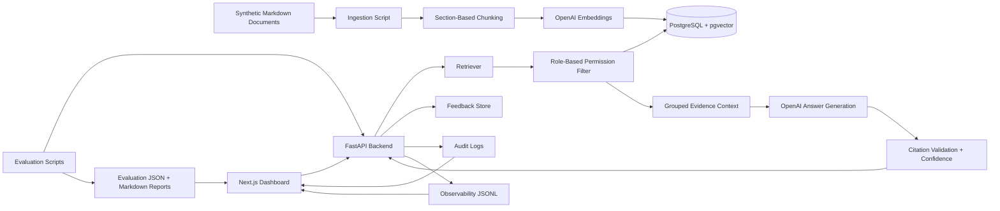

# Enterprise Knowledge Agent

Enterprise Knowledge Agent is a portfolio-grade enterprise RAG system that simulates a secure internal company assistant. Employees can ask questions across synthetic HR, IT/security, sales, manager, HR admin, and IT admin documents and receive cited, permission-aware answers.

This is intentionally more than a PDF chatbot. The project includes a synthetic enterprise dataset, a 60-question benchmark, retrieval experiments, citation validation, confidence scoring, role-based permission filtering, session memory, prompt versioning, feedback, observability, audit logs, evaluation dashboards, multi-document reasoning, Dockerized local setup, CI, and Azure-ready deployment documentation.

## Recruiter Summary

Built an enterprise RAG knowledge assistant with PostgreSQL/pgvector retrieval, OpenAI generation, cited answers, RBAC enforcement, benchmark-driven evaluation, live observability, Docker packaging, and Azure-ready deployment planning.

The main portfolio story:

> Baseline RAG was measured, weaknesses were identified, retrieval and prompting were improved, and the final system demonstrates enterprise-grade controls around citations, permissions, evaluation, memory, observability, and deployment readiness.

## Why This Is Not A Basic Chatbot

- Evaluation-first: a 60-question benchmark measures retrieval, answer quality, citations, permissions, memory, missing information, and multi-document reasoning.
- Permission-aware: restricted documents are filtered before generation, and permission leakage is evaluated separately.
- Citation-focused: generated answers include citations and citation validation.
- Measured iteration: vector, keyword, hybrid, prompt, memory, and multi-document changes are compared with real metrics.
- Demo-ready: the project includes a Next.js evaluation dashboard, Docker Compose stack, health/readiness endpoints, smoke tests, and Azure-ready docs.
- Honest limitations: synthetic data, no production auth yet, chat-generation cost estimation only, and remaining multi-document retrieval misses are documented.

## Key Features

- Synthetic enterprise document corpus with role-based access metadata.
- Markdown ingestion with section-based chunking.
- PostgreSQL and pgvector vector retrieval.
- Keyword and hybrid retrieval experiments.
- Structured answer generation with response types.
- Citation formatting and citation validation.
- Confidence scoring.
- Permission-filtered retrieval and restricted refusal behavior.
- Permission leakage evaluation.
- Session-level conversation memory and query rewriting.
- Prompt versioning and prompt experiment tracking.
- Feedback collection and feedback-to-evaluation workflow.
- Observability request logs and live observability dashboard.
- Audit logs for security-relevant events.
- Evaluation dashboard with run comparison, failed questions, prompt experiments, permissions, memory, and multi-document views.
- Multi-document query decomposition, grouped evidence, and synthesis prompt.
- Docker Compose local stack with Postgres/pgvector, FastAPI, and Next.js.
- Health and readiness endpoints.
- Smoke test script.
- CI workflow for Python compile, frontend build, and Docker builds.
- Azure-ready deployment plan.

## Tech Stack

| Area | Technology |
|---|---|
| Frontend | Next.js, TypeScript, Tailwind |
| Backend | Python, FastAPI |
| AI | OpenAI chat and embeddings APIs |
| Database | PostgreSQL, pgvector |
| Retrieval | Vector search, PostgreSQL full-text search, hybrid experiments |
| Evaluation | Custom benchmark runners and deterministic scoring helpers |
| Observability | JSONL request logs, live summary endpoints, cost estimates, dashboard views |
| Security controls | Role-based document access, audit logs, permission evaluations |
| Packaging | Docker, Docker Compose |
| Cloud readiness | Azure Container Apps/App Service, Azure Database for PostgreSQL, ACR, Key Vault, Blob Storage future target |

## Architecture



The backend owns ingestion, retrieval, permissions, memory, answer generation, citations, confidence scoring, feedback, observability, audit logs, and evaluation APIs. The frontend is an evaluation and operations dashboard, not a marketing site.

More detail:

- [Architecture Overview](docs/phase-4/architecture-overview.md)
- [Database Schema](docs/phase-4/database-schema.md)
- [Retrieval Pipeline](docs/phase-4/retrieval-pipeline.md)
- [Permissions Design](docs/phase-4/permissions-design.md)
- [Phase 14 Deployment Architecture](docs/phase-14/deployment-architecture.md)
- [Demo Architecture Diagram Guide](docs/demo/architecture-diagram.md)

## Evaluation Benchmark

The benchmark contains 60 synthetic enterprise questions across:

- Simple factual lookup.
- Multi-document reasoning.
- Permission-restricted questions.
- Missing-information questions.
- Ambiguous questions.
- Conversation-memory follow-ups.

Evaluation covers:

- Retrieval hit rate, source recall, Precision@k, MRR.
- Answer accuracy and response type accuracy.
- Citation accuracy and citation faithfulness signals.
- Hallucination rate.
- Permission leakage and unauthorized chunk exposure.
- Memory rewrite and memory answer accuracy.
- Multi-document source coverage and all-required-sources citation rate.

Benchmark artifacts:

- [Benchmark Questions](data/evaluation/benchmark-questions.json)
- [Benchmark Design](docs/phase-3/benchmark-design.md)
- [Scoring Rubric](docs/phase-3/scoring-rubric.md)
- [Dashboard Summary Data](data/evaluation/dashboard-summary.json)

## Final Metrics

All numbers below come from existing evaluation outputs. Chat-generation cost is estimated from configured model pricing; embedding and infrastructure cost are still future work.

### Retrieval

| Metric | Value |
|---|---:|
| Best retrieval configuration | `vector-section` |
| All-sources retrieval hit | `0.975` |
| Precision@k | `0.650` |
| MRR | `0.980` |

Source: [Phase 6 Evaluation Results](docs/phase-6/evaluation-results.md)

### Answer Quality

| Metric | Value |
|---|---:|
| Answer accuracy | `0.829` |
| Citation accuracy | `0.857` |
| Hallucination rate | `0.156` |

Source: [Phase 7 Evaluation Results](docs/phase-7/evaluation-results.md)

### Permission Safety

| Metric | Value |
|---|---:|
| Permission leakage rate | `0.000` |
| Blocked-answer accuracy | `1.000` |
| Unauthorized chunk exposure rate | `0.000` |
| Restricted citation leakage rate | `0.000` |
| Unauthorized chunks reached generation rate | `0.000` |

Source: [Phase 8 Permission Evaluation Results](docs/phase-8/permission-evaluation-results.md)

### Conversation Memory

| Metric | Value |
|---|---:|
| Follow-up detection accuracy | `1.000` |
| Query rewrite quality | `1.000` |
| Memory answer accuracy | `1.000` |
| Memory citation accuracy | `1.000` |
| Memory response type accuracy | `1.000` |
| Memory permission leakage | `0.000` |

Source: [Phase 9 Memory Evaluation Results](docs/phase-9/memory-evaluation-results.md)

### Multi-Document Reasoning

| Metric | Baseline | Multi-doc |
|---|---:|---:|
| Answer accuracy | `0.700` | `0.850` |
| Citation accuracy | `0.750` | `0.900` |
| Response type accuracy | `0.900` | `1.000` |
| All required sources cited | `0.600` | `0.800` |
| Failed questions | `4` | `2` |
| Hallucination rate | `0.667` | `0.700` |

Source: [Multi-Doc Evaluation JSON](data/evaluation/multi-doc-eval.json)

### Deployment Readiness

| Check | Status |
|---|---|
| Docker Compose config | Passed |
| Docker image build | Passed for API and web |
| API `/health` | Passed |
| API `/ready` | Passed |
| Postgres/pgvector setup | Passed |
| Smoke test | Passed in latest user run |
| Azure deployment | Azure-ready, not deployed |
| Chat cost tracking | Estimated from configured model pricing |

Source: [Phase 14 Smoke Test Results](docs/phase-14/smoke-test-results.md)

## App And Dev/Admin UI

The frontend now separates the recruiter-facing App surface from the Dev/Admin proof surface.

App routes:

- `/` App Home with links to project workspaces, the working assistant, and Dev/Admin proof.
- `/projects` project workspace list with create, edit, archive, seeded corpus coverage, quality status, and recent project audit events.
- `/projects/[projectId]` selected project workspace home.
- `/projects/[projectId]/departments/[departmentId]` department workspace detail with icon, access defaults, document library, PDF upload for Markdown review, active version metadata, extracted Markdown preview, edit, and archive controls.
- `/chat` live project-scoped RAG demo with project and department scope selectors, role selector, presets, citations, confidence, latency, retrieved context, and feedback.

Dev/Admin routes:

- `/dev-admin` overview metrics and measured RAG progress.
- `/dev-admin/runs` evaluation run comparison.
- `/dev-admin/evaluation/runs/phase11-answer-generation-v1` per-question benchmark explorer for detailed runs.
- `/dev-admin/failed-questions` expandable failure backlog with expected answers, actual answers, citations, fixes, and human review labels.
- `/dev-admin/retrieval-playground` Algorithm Quality Lab with named profiles, historical metrics, live source coverage, known failures, cost/latency signals, and review notes.
- `/dev-admin/permission-demo` role comparison for restricted questions.
- `/dev-admin/multi-doc` multi-document reasoning comparison.
- `/dev-admin/observability` live latency, token, and confidence logs.
- `/dev-admin/feedback` answer feedback summaries and negative-feedback review controls.
- `/dev-admin/audit` security-relevant audit events.

Deep evaluation pages such as `/dev-admin/retrieval-experiments`, `/dev-admin/prompt-experiments`, `/dev-admin/permission-safety`, and `/dev-admin/memory-evaluation` remain available for deeper review.

Recommended interactive demo presets:

- Project workspace: open `/projects` and select the seeded `Northstar Analytics` project.
- Department workspace: open a seeded Northstar department such as `People Operations`, `IT Admin`, or `Sales`.
- Document library: open a seeded department and inspect indexed documents, version metadata, access roles, ingestion status, and extracted Markdown preview.
- PDF upload review: upload a PDF into a department to extract Markdown as a pending-review document; it is not indexed for retrieval until a later approval/indexing step.
- Scoped assistant: open `/chat`, keep `Northstar Analytics` selected, and optionally narrow the question to one department before submitting.
- HR factual: `Where does Northstar Analytics have offices?`
- Missing information: `What is Northstar's sabbatical policy?`
- Restricted manager question: `What is the promotion calibration process?`
- Memory follow-up scenario: seeded vacation question followed by `Can I carry any unused days into next year?`
- Multi-document: `If I work remotely, what approval and device security expectations apply?`
- Known failure: MULTI-005 sales positioning question.
- Human review: label a failed question or negative feedback item with answer/citation correctness and save it as an evaluation candidate, needs-fix item, approved reference, or rejected item.

The `/chat` page is a recruiter/demo UI over the existing API. It is not production authentication.

Screenshots to capture:

- App Home.
- Project workspace for `Northstar Analytics`.
- Department workspace for a seeded Northstar department.
- Retrieval comparison.
- Permission safety page.
- Memory evaluation page.
- Multi-document comparison page.
- Observability page.
- Audit page.
- Chat demo response with citations and retrieved context.
- Permission refusal example.

See [Screenshots Checklist](docs/demo/screenshots-checklist.md).

## Docker Quickstart

Create a local `.env` file and add your OpenAI key:

```powershell
Copy-Item .env.example .env
```

Start Postgres with pgvector, FastAPI, and the Next.js dashboard:

```powershell
docker compose up --build
```

Open:

- Dashboard: `http://localhost:3000`
- API: `http://localhost:8000`
- API health: `http://localhost:8000/health`
- API readiness: `http://localhost:8000/ready`

If port `3000` is already in use, set `WEB_PORT=3001` in `.env` and open `http://localhost:3001`.

## Database Setup And Ingestion

Apply and verify the database schema:

```powershell
docker compose run --rm api python scripts/setup_db.py
```

Ingest the synthetic Markdown corpus:

```powershell
docker compose run --rm api python scripts/ingest_markdown.py --apply-schema --chunking-strategy section_based
```

The ingestion command calls the OpenAI embeddings API, so `OPENAI_API_KEY` must be configured.

## Smoke Test

Run the end-to-end smoke test:

```powershell
docker compose run --rm api python scripts/run_smoke_test.py --api-base-url http://api:8000
```

The smoke test verifies:

- API health.
- API readiness.
- Document/chunk counts.
- A normal answer response shape.
- A restricted Employee query returning `refuse_no_access`.
- No unauthorized chunks reaching generation.

## Evaluation Commands

Run evaluations inside the API container after ingestion:

```powershell
docker compose run --rm api python scripts/run_retrieval_experiments.py
docker compose run --rm api python scripts/run_answer_quality_eval.py
docker compose run --rm api python scripts/run_permission_eval.py
docker compose run --rm api python scripts/run_memory_eval.py
docker compose run --rm api python scripts/run_multi_doc_eval.py
docker compose run --rm api python scripts/export_dashboard_data.py
```

Open the dashboard after exporting data.

## Demo And Portfolio Materials

- [Demo Script](docs/demo/demo-script.md)
- [Interactive Demo Guide](docs/demo/interactive-demo-guide.md)
- [Portfolio Case Study](docs/demo/portfolio-case-study.md)
- [Resume Bullets](docs/demo/resume-bullets.md)
- [Architecture Diagram Guide](docs/demo/architecture-diagram.md)
- [Screenshots Checklist](docs/demo/screenshots-checklist.md)
- [Final Cleanup Checklist](docs/demo/final-cleanup-checklist.md)

## Known Limitations

- The corpus is synthetic and intentionally avoids real employee or customer data.
- The project is Azure-ready but has not been deployed to Azure yet.
- Production authentication and SSO are not implemented.
- There are no real SharePoint, Slack, Teams, Google Drive, or HRIS connectors yet.
- Raw document storage still uses repository files, not Azure Blob Storage.
- Chat-generation cost is estimated from configured model pricing; embedding, hosting, and Azure infrastructure costs are not included yet.
- `MULTI-005` still fails due to a `SALES-002` retrieval miss.
- Multi-document detection is heuristic.
- The `/chat` page is a demo UI, not a production end-user assistant with authentication.
- Project-scoped retrieval is implemented for `/chat` and `POST /query` when a scope is supplied. Dev/Admin benchmark tools can still use the global retrieval path when no scope is supplied.
- Department-scoped retrieval is implemented as a strict filter when a department scope is supplied. Uploaded-document indexing is not implemented yet.
- Department document libraries and PDF-to-Markdown review uploads are implemented, but approval/indexing for uploaded files is not implemented yet.
- Uploaded source files are stored locally under `data/uploads/` for development and are ignored by git; Azure Blob Storage remains future work.
- Runtime request logs such as `data/observability/request-logs.jsonl` are generated data and should be reviewed before committing.

## Roadmap

- Deploy the containers to Azure Container Apps or Azure App Service.
- Use Azure Database for PostgreSQL with pgvector.
- Add production auth with Clerk or Auth.js.
- Persist raw documents and durable logs in Azure Blob Storage.
- Add PDF and DOCX ingestion.
- Add review approval and indexing for uploaded PDF Markdown.
- Add project-scoped benchmark runs and promotion gates.
- Add real enterprise connectors.
- Evaluate Azure AI Search or reranking for unresolved retrieval misses.
- Improve multi-document retrieval and source coverage.
- Extend cost tracking to embeddings, ingestion, and cloud infrastructure estimates.
- Build a richer admin UI for permissions, ingestion, and evaluation review.
- Turn the demo chat into a production-grade authenticated assistant if this moves beyond portfolio scope.

## Project Documentation

Phase artifacts are preserved for review:

- [Phase 1](docs/phase-1/product-scope.md): product scope, personas, success metrics.
- [Phase 2](docs/phase-2/document-inventory.md): synthetic corpus and access model.
- [Phase 3](docs/phase-3/benchmark-design.md): benchmark and scoring rubric.
- [Phase 4](docs/phase-4/architecture-overview.md): architecture, schema, APIs, retrieval, permissions.
- [Phase 5](docs/phase-5/baseline-rag-implementation.md): baseline RAG.
- [Phase 6](docs/phase-6/evaluation-results.md): retrieval experiments.
- [Phase 7](docs/phase-7/evaluation-results.md): answer generation, citations, confidence.
- [Phase 8](docs/phase-8/permission-evaluation-results.md): permission safety.
- [Phase 9](docs/phase-9/memory-evaluation-results.md): conversation memory.
- [Phase 10](docs/phase-10/evaluation-dashboard-design.md): dashboard.
- [Phase 11](docs/phase-11/prompt-experiment-results.md): prompt experiments.
- [Phase 12](docs/phase-12/observability-design.md): feedback, observability, audit.
- [Phase 13](docs/phase-13/multi-document-reasoning-design.md): multi-document reasoning.
- [Phase 14](docs/phase-14/docker-local-setup.md): Docker and Azure readiness.
- [Phase 15 Interactive UX](docs/phase-15/interactive-demo-ux.md): recruiter-facing interactive demo.
- [Phase 16](docs/phase-16/cost-tracking.md): chat-generation cost tracking.
- [Phase 18](docs/phase-18/app-admin-navigation-design.md): App and Dev/Admin navigation split.
- [Phase 19](docs/phase-19/project-workspace-design.md): project workspace model and UI.
- [Phase 20](docs/phase-20/department-workspace-design.md): department workspace model and UI.
- [Phase 21](docs/phase-21/document-library-design.md): document library and ingestion status planning.
- [Phase 22](docs/phase-22/pdf-extraction-design.md): PDF upload and deterministic Markdown extraction.
- [Phase 23](docs/phase-23/project-scoped-rag-design.md): project- and department-scoped retrieval.
- [Phase 24](docs/phase-24/algorithm-quality-lab-design.md): named retrieval profiles and algorithm review workflow.
- [Phase 25](docs/phase-25/result-verification-review-design.md): human review labels for failed questions and feedback-derived candidates.

## Final Portfolio Description

Enterprise Knowledge Agent is a full-stack enterprise RAG portfolio project that demonstrates secure retrieval, role-based permissions, citation-grounded answer generation, benchmark-driven iteration, operational observability, Dockerized local deployment, and Azure-ready architecture. It shows how an internal AI assistant can be evaluated and hardened beyond a simple chatbot demo.
