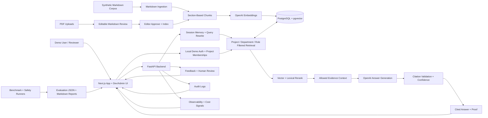

# Proofbase: Permission-Aware Enterprise RAG

**Proofbase** is a portfolio-grade enterprise RAG system that simulates a secure internal company assistant. Users work inside project and department knowledge spaces, ask scoped questions across synthetic HR, IT/security, sales, manager, finance, legal, engineering, support, operations, HR admin, and IT admin documents, and receive cited, permission-aware answers.

This is intentionally more than a PDF chatbot. The project includes a synthetic enterprise dataset, local demo auth, project workspaces, department document libraries, PDF-to-Markdown review uploads, scoped retrieval, a 130-question benchmark corpus with current benchmark v1.1 retrieval and answer-quality runs, retrieval experiments, citation validation, confidence scoring, role-based permission filtering, session memory, prompt versioning, feedback, observability, audit logs, human review workflows, evaluation dashboards, multi-document reasoning, Dockerized local setup, CI, and Azure-ready deployment documentation.

## Recruiter Summary

Built an enterprise RAG knowledge assistant with local demo identity, project memberships, project workspaces, department document libraries, PostgreSQL/pgvector retrieval, OpenAI generation, cited answers, RBAC enforcement, benchmark-driven evaluation, human review, live observability, Docker packaging, and Azure-ready deployment planning.

The main portfolio story:

> Baseline RAG was measured, weaknesses were identified, retrieval and prompting were improved, and the final system demonstrates an App-side knowledge workspace backed by enterprise-grade controls around citations, permissions, evaluation, memory, observability, human review, and deployment readiness.

## Why This Is Not Just A Chatbot

A basic chatbot sends user text to a model and returns prose. **Proofbase** treats internal answering as a product, retrieval, and evaluation problem: knowledge is organized into project and department workspaces, retrieval is filtered by role before generation, answers carry citations, citations are validated against retrieved evidence, and algorithm changes are measured before they are promoted. The App side demonstrates the user workflow; the Dev/Admin side proves quality, permissions, memory behavior, failures, feedback, observability, and auditability.

- Evaluation-first: a 130-question benchmark corpus measures retrieval, answer quality, citations, permissions, memory, missing information, multi-document reasoning, prompt-injection handling, and conflicting-source handling; current retrieval and answer-quality scorecard runs use benchmark v1.1, with separate permission and memory safety suites.
- Product-shaped: projects, departments, document libraries, PDF extraction review, and scoped assistant controls make the demo feel like a real internal app.
- Permission-aware: restricted documents are filtered before generation, and permission leakage is evaluated separately.
- Citation-focused: generated answers include citations and citation validation.
- Measured iteration: vector, keyword, hybrid, prompt, memory, and multi-document changes are compared with real metrics.
- Demo-ready: the project includes a Next.js App and Dev/Admin UI, Docker Compose stack, health/readiness endpoints, smoke tests, and Azure-ready docs.
- Honest limitations: synthetic data, local demo auth only, no production SSO yet, chat-generation cost estimation only, and remaining multi-document retrieval misses are documented.

## Key Features

- Synthetic enterprise document corpus with role-based access metadata.
- Markdown ingestion with section-based chunking.
- PostgreSQL and pgvector vector retrieval.
- Keyword and hybrid retrieval experiments.
- Structured answer generation with response types.
- Citation formatting and citation validation.
- Confidence scoring.
- Permission-filtered retrieval and restricted refusal behavior.
- Permission leakage evaluation.
- Session-level conversation memory and query rewriting.
- Prompt versioning and prompt experiment tracking.
- Feedback collection, failed-question review, and feedback-to-evaluation workflow.
- Observability request logs and live observability dashboard.
- Audit logs for security-relevant events.
- Local demo users and project memberships with server-side role derivation.
- Evaluation dashboard with run comparison, failed questions, prompt experiments, permissions, memory, and multi-document views.
- Multi-document query decomposition, grouped evidence, and synthesis prompt.
- Docker Compose local stack with Postgres/pgvector, FastAPI, and Next.js.
- Health and readiness endpoints.
- Smoke test script.
- CI workflow for Python compile, frontend build, and Docker builds.
- Azure-ready deployment plan.

## Tech Stack

| Area | Technology |
|---|---|
| Frontend | Next.js, TypeScript, Tailwind |
| Backend | Python, FastAPI |
| AI | OpenAI chat and embeddings APIs |
| Database | PostgreSQL, pgvector |
| Retrieval | Vector search, PostgreSQL full-text search, hybrid experiments |
| Evaluation | Custom benchmark runners and deterministic scoring helpers |
| Observability | JSONL request logs, live summary endpoints, cost estimates, dashboard views |
| Security controls | Role-based document access, audit logs, permission evaluations |
| Packaging | Docker, Docker Compose |
| Cloud readiness | Azure Container Apps/App Service, Azure Database for PostgreSQL, ACR, Key Vault, Blob Storage future target |

## Architecture



The backend owns ingestion, retrieval, permissions, memory, answer generation, citations, confidence scoring, feedback, observability, audit logs, and evaluation APIs. The frontend is split into an App surface for projects, departments, document libraries, and scoped chat, plus a Dev/Admin surface for evaluation and operations proof.

More detail:

- [Architecture Overview](docs/phase-4/architecture-overview.md)
- [Database Schema](docs/phase-4/database-schema.md)
- [Retrieval Pipeline](docs/phase-4/retrieval-pipeline.md)
- [Permissions Design](docs/phase-4/permissions-design.md)
- [Docker And Azure Readiness (Phase 14) Deployment Architecture](docs/phase-14/deployment-architecture.md)
- [Demo Architecture Diagram Guide](docs/demo/architecture-diagram.md)

## Evaluation Benchmark

The benchmark corpus contains 130 synthetic enterprise questions. Current retrieval and answer-quality scorecard runs use benchmark v1.1 over the full 130-question corpus, while permission safety and memory use separate focused suites.

The corpus covers:

- Simple factual lookup.
- Multi-document reasoning.
- Permission-restricted questions.
- Missing-information questions.
- Ambiguous questions.
- Conversation-memory follow-ups.
- Prompt-injection and adversarial-source questions.
- Conflicting-source and versioned-policy questions.

Evaluation covers:

- Retrieval hit rate, source recall, Precision@k, MRR.
- Answer accuracy and response type accuracy.
- Citation accuracy and citation faithfulness signals.
- Hallucination rate.
- Permission leakage and unauthorized chunk exposure.
- Memory rewrite and memory answer accuracy.
- Multi-document source coverage and all-required-sources citation rate.

Benchmark artifacts:

- [Benchmark Questions](data/evaluation/benchmark-questions.json)
- [Benchmark Design](docs/phase-3/benchmark-design.md)
- [Scoring Rubric](docs/phase-3/scoring-rubric.md)
- [Dashboard Summary Data](data/evaluation/dashboard-summary.json)

## Final Metrics

All numbers below come from existing evaluation outputs and do not all use the same sample size. The current retrieval and answer-quality scorecard runs use benchmark v1.1 over 130 questions, permission safety uses 20 restricted-access questions, and memory evaluation uses a separate 20-question follow-up suite plus focused boundary probes. Chat-generation cost is estimated from configured model pricing; embedding and infrastructure cost are still future work.

### Retrieval

| Metric | Value | Run | Sample |
|---|---:|---|---:|
| Current retrieval reference | `vector + lexical rerank` | Lexical Rerank Candidate top-3 (`phase33-vector-lexical-rerank-top3`) | 130 |
| All-sources retrieval hit | `0.922` | Lexical Rerank Candidate top-3 (`phase33-vector-lexical-rerank-top3`) | 130 |
| Precision@k | `0.778` | Lexical Rerank Candidate top-3 (`phase33-vector-lexical-rerank-top3`) | 130 |
| MRR | `0.965` | Lexical Rerank Candidate top-3 (`phase33-vector-lexical-rerank-top3`) | 130 |

Source: [Lexical Rerank Candidate (Phase 33) Results](docs/phase-33/precision-candidate-results.md)

### Answer Quality

| Metric | Value | Run | Sample |
|---|---:|---|---:|
| Answer accuracy | `1.000` | Live Query Answer Quality v8 (`phase39-live-query-answer-quality-v8`) | 130 |
| Citation accuracy | `1.000` | Live Query Answer Quality v8 (`phase39-live-query-answer-quality-v8`) | 130 |
| Hallucination rate | `0.000` | Live Query Answer Quality v8 (`phase39-live-query-answer-quality-v8`) | 130 |
| Failed questions | `0` | Live Query Answer Quality v8 (`phase39-live-query-answer-quality-v8`) | 130 |

Source: [Phase 39 Live Query Answer-Quality Results](docs/phase-39/live-query-answer-quality-results.md)

### Permission Safety

| Metric | Value | Run | Sample |
|---|---:|---|---:|
| Permission leakage rate | `0.000` | Phase 46 Permission Evaluation (`phase46-permission-evaluation`) | 20 |
| Blocked-answer accuracy | `1.000` | Phase 46 Permission Evaluation (`phase46-permission-evaluation`) | 20 |
| Unauthorized chunk exposure rate | `0.000` | Phase 46 Permission Evaluation (`phase46-permission-evaluation`) | 20 |
| Restricted citation leakage rate | `0.000` | Phase 46 Permission Evaluation (`phase46-permission-evaluation`) | 20 |
| Unauthorized chunks reached generation rate | `0.000` | Phase 46 Permission Evaluation (`phase46-permission-evaluation`) | 20 |

Source: [Phase 46 Permission Safety Results](docs/phase-46/permission-safety-results.md)

### Conversation Memory

| Metric | Value | Run | Sample |
|---|---:|---|---:|
| Follow-up detection accuracy | `1.000` | Expanded Memory Evaluation (`phase36-memory-evaluation`) | 20 |
| Query rewrite quality | `1.000` | Expanded Memory Evaluation (`phase36-memory-evaluation`) | 20 |
| Memory answer accuracy | `1.000` | Expanded Memory Evaluation (`phase36-memory-evaluation`) | 20 |
| Memory citation accuracy | `1.000` | Expanded Memory Evaluation (`phase36-memory-evaluation`) | 20 |
| Memory response type accuracy | `1.000` | Expanded Memory Evaluation (`phase36-memory-evaluation`) | 20 |
| Memory permission leakage | `0.000` | Expanded Memory Evaluation (`phase36-memory-evaluation`) | 20 |

Source: [Regression Scorecard Data](data/evaluation/regression-scorecard.json)

### Multi-Document Reasoning

| Metric | Baseline | Multi-doc |
|---|---:|---:|
| Answer accuracy | `0.850` | `0.925` |
| Citation accuracy | `0.850` | `0.925` |
| Response type accuracy | `1.000` | `1.000` |
| All required sources cited | `0.700` | `0.850` |
| Failed questions | `4` | `2` |
| Hallucination rate | `0.050` | `0.000` |

Source: [Multi-Doc Evaluation JSON](data/evaluation/multi-doc-eval.json)

### Deployment Readiness

| Check | Status |
|---|---|
| Docker Compose config | Passed |
| Docker image build | Passed for API and web |
| API `/health` | Passed |
| API `/ready` | Passed |
| Postgres/pgvector setup | Passed |
| Smoke test | Passed in latest user run |
| Local demo auth | Passed for member, guest, and admin/non-admin checks |
| Azure deployment | Azure-ready, not deployed |
| Chat cost tracking | Estimated from configured model pricing |

Source: [Docker And Azure Readiness (Phase 14) Smoke Test Results](docs/phase-14/smoke-test-results.md)

## App And Dev/Admin UI

The frontend now separates the recruiter-facing App surface from the Dev/Admin proof surface.

App routes:

- `/` App Home with links to project workspaces, the working assistant, and Dev/Admin proof.
- `/projects` project workspace list with create, edit, archive, seeded corpus coverage, quality status, and recent project audit events.
- `/projects/[projectId]` selected project workspace home.
- `/projects/[projectId]/departments/[departmentId]` department workspace detail with icon, access defaults, document library, PDF upload for Markdown review, optional AI cleanup draft, cleanup provenance, before/after review diff, active version metadata, extracted Markdown preview, edit, and archive controls.
- `/chat` live project-scoped RAG demo with project and department scope selectors, signed-in demo role context, presets, citations, confidence, latency, retrieved context, and feedback.
- `/algorithm` App-side Algorithm Guide with a plain-English RAG overview, glossary, flow graph, safety funnel, and links to proof surfaces.

Dev/Admin routes:

- `/dev-admin` overview metrics and measured RAG progress.
- `/dev-admin/runs` evaluation run comparison.
- `/dev-admin/evaluation/runs/phase11-answer-generation-v1` per-question benchmark explorer for Answer Generation v1 (`phase11-answer-generation-v1`).
- `/dev-admin/failed-questions` expandable failure backlog with expected answers, actual answers, citations, fixes, and human review labels.
- `/dev-admin/retrieval-playground` Algorithm Quality Lab with named profiles, historical metrics, live source coverage, historical failure evidence, cost/latency signals, and review notes.
- `/dev-admin/permission-demo` role comparison for restricted questions.
- `/dev-admin/multi-doc` multi-document reasoning comparison.
- `/dev-admin/observability` live latency, token, and confidence logs.
- `/dev-admin/feedback` answer feedback summaries and negative-feedback review controls.
- `/dev-admin/audit` security-relevant audit events.

Deep evaluation pages such as `/dev-admin/retrieval-experiments`, `/dev-admin/prompt-experiments`, `/dev-admin/permission-safety`, and `/dev-admin/memory-evaluation` remain available for deeper review.

Recommended interactive demo presets:

- Project workspace: open `/projects` and select the seeded `Northstar Analytics` project.
- Department workspace: open a seeded Northstar department such as `People Operations`, `IT Admin`, or `Sales`.
- Document library: open a seeded department and inspect indexed documents, version metadata, access roles, ingestion status, and extracted Markdown preview.
- PDF upload review: upload a PDF into a department to extract editable Markdown as a pending-review document; optionally request AI Markdown cleanup as a review draft; inspect cleanup metadata and diff; it becomes searchable only after explicit editor approval/indexing.
- Scoped assistant: open `/chat`, keep `Northstar Analytics` selected, and optionally narrow the question to one department before submitting.
- HR factual: `Where does Northstar Analytics have offices?`
- Missing information: `What is Northstar's sabbatical policy?`
- Restricted manager question: `What is the promotion calibration process?`
- Memory follow-up scenario: seeded vacation question followed by `Can I carry any unused days into next year?`
- Multi-document: `If I work remotely, what approval and device security expectations apply?`
- Historical stress case: MULTI-005 sales positioning question. The current live `/query` scorecard run has `0` failed benchmark questions, but this remains useful for showing multi-source behavior.
- Human review: label a failed question or negative feedback item with answer/citation correctness and save it as an evaluation candidate, needs-fix item, approved reference, or rejected item.

The `/chat` page is a recruiter/demo UI over local demo auth. The API derives the App query role from the selected demo user instead of trusting a free-form role selector, but this is not production SSO.

Screenshots to capture:

- App Home with the five-minute demo path.
- Project workspace for `Northstar Analytics`.
- Department workspace for a seeded Northstar department with document library and Markdown preview.
- Chat demo response with project scope, citations, confidence, latency, and retrieved context.
- Algorithm Guide with the RAG flow graph, glossary, and safety funnel.
- Algorithm Quality Lab with profile comparison and historical failure visibility.
- Failed-question or feedback review with answer/citation labels.
- Deep retrieval comparison.
- Permission safety page.
- Memory evaluation page.
- Multi-document comparison page.
- Observability page.
- Audit page.
- Permission refusal example.

See [Screenshots Checklist](docs/demo/screenshots-checklist.md).

## Docker Quickstart

Create a local `.env` file and add your OpenAI key:

```powershell
if (-not (Test-Path .env)) { Copy-Item .env.example .env }
```

Do not rerun `Copy-Item .env.example .env` against an existing `.env`; it overwrites local secrets such as `OPENAI_API_KEY`.

Start Postgres with pgvector, FastAPI, and the Next.js App and Dev/Admin UI:

```powershell
docker compose up --build
```

Open:

- App and Dev/Admin UI: `http://localhost:3000`
- API: `http://localhost:8000`
- API health: `http://localhost:8000/health`
- API readiness: `http://localhost:8000/ready`

The local demo defaults to Emma Employee. Use the header selector in the web app to switch demo users, including Kai Admin for Dev/Admin access and Gus Guest for unauthorized-access checks.

If port `3000` is already in use, set `WEB_PORT=3001` in `.env` and open `http://localhost:3001`.

## Database Setup And Ingestion

Apply and verify the database schema:

```powershell
docker compose run --rm api python scripts/setup_db.py
```

Ingest the synthetic Markdown corpus:

```powershell
docker compose run --rm api python scripts/ingest_markdown.py --apply-schema --chunking-strategy section_based
```

The ingestion command calls the OpenAI embeddings API, so `OPENAI_API_KEY` must be configured.

The seeded corpus currently contains 19 synthetic Markdown documents. Current dashboard metrics come from exported evaluation artifacts over benchmark v1.1 and related focused suites, including the Phase 33 retrieval reference, Phase 39 live `/query` answer-quality run, Phase 36 memory evaluation, and later permission-safety runs.

## Smoke Test

Run the end-to-end smoke test:

```powershell
docker compose run --rm api python scripts/run_smoke_test.py --api-base-url http://api:8000
```

The smoke test verifies:

- API health.
- API readiness.
- Document/chunk counts.
- A normal answer response shape.
- A restricted Employee query returning `refuse_no_access`.
- No unauthorized chunks reaching generation.

## Evaluation Commands

Run evaluations inside the API container after ingestion:

```powershell
docker compose run --rm api python scripts/validate_benchmark.py
docker compose run --rm api python scripts/run_retrieval_experiments.py
docker compose run --rm api python scripts/run_answer_quality_eval.py
docker compose run --rm api python scripts/run_permission_eval.py
docker compose run --rm api python scripts/run_memory_eval.py
docker compose run --rm api python scripts/run_multi_doc_eval.py
docker compose run --rm api python scripts/export_dashboard_data.py
```

Open the dashboard after exporting data. Run the benchmark validator before publishing refreshed metrics so schema and source-document references are checked first.

## Demo And Portfolio Materials

- [Demo Script](docs/demo/demo-script.md)
- [Interactive Demo Guide](docs/demo/interactive-demo-guide.md)
- [Portfolio Case Study](docs/demo/portfolio-case-study.md)
- [Resume Bullets](docs/demo/resume-bullets.md)
- [Architecture Diagram Guide](docs/demo/architecture-diagram.md)
- [Screenshots Checklist](docs/demo/screenshots-checklist.md)
- [Final Cleanup Checklist](docs/demo/final-cleanup-checklist.md)

## Known Limitations

- The corpus is synthetic and intentionally avoids real employee or customer data.
- The project is Azure-ready but has not been deployed to Azure yet.
- Local demo auth is implemented with seeded demo users and project memberships. Production authentication and SSO are not implemented.
- There are no real SharePoint, Slack, Teams, Google Drive, or HRIS connectors yet.
- Raw document storage still uses repository files, not Azure Blob Storage.
- Chat-generation cost is estimated from configured model pricing; embedding, hosting, and Azure infrastructure costs are not included yet.
- The current live `/query` answer-quality scorecard run has `0` failed benchmark questions, but it still reports diagnostic submetric notes for memory response-type historical comparability and one clarification source-coverage diagnostic. These are tracked separately from failed answers.
- Multi-document detection is heuristic.
- The `/chat` page is a demo UI backed by local demo auth, not a production end-user assistant with SSO/session hardening.
- Project-scoped retrieval is implemented for `/chat` and `POST /query` when a scope is supplied. Dev/Admin benchmark tools can still use the global retrieval path when no scope is supplied.
- Department-scoped retrieval is implemented as a strict filter when a department scope is supplied.
- Department document libraries, PDF-to-Markdown review uploads, optional AI cleanup drafts, cleanup provenance, review diffs, editable review, and explicit approval/indexing for uploaded files are implemented for the local demo.
- AI Markdown cleanup is editor-triggered, reviewable, reversible, and not indexed automatically; deterministic extraction and manual approval remain available if OpenAI is unavailable.
- Uploaded source files are stored locally under `data/uploads/` for development and are ignored by git; Azure Blob Storage remains future work.
- Runtime request logs such as `data/observability/request-logs.jsonl` are generated data and should be reviewed before committing.

## Roadmap

- Deploy the containers to Azure Container Apps or Azure App Service.
- Use Azure Database for PostgreSQL with pgvector.
- Replace local demo auth with production auth using Clerk, Auth.js, or the chosen enterprise identity provider.
- Persist raw documents and durable logs in Azure Blob Storage.
- Add DOCX ingestion and richer uploaded-document conversion coverage.
- Add richer cleanup comparison ergonomics, hosted document storage, and production storage migration.
- Add project-scoped benchmark runs and promotion gates.
- Add real enterprise connectors.
- Evaluate Azure AI Search or reranking for unresolved retrieval misses.
- Continue expanding multi-document and source-coverage generalization beyond the current benchmark.
- Extend cost tracking to embeddings, ingestion, and cloud infrastructure estimates.
- Build a richer admin UI for permissions, ingestion, and evaluation review.
- Turn the demo chat into a production-grade authenticated assistant if this moves beyond portfolio scope.

## Project Documentation

Phase artifacts are preserved for review:

- [Product Scope (Phase 1)](docs/phase-1/product-scope.md): product scope, personas, success metrics.
- [Document Inventory (Phase 2)](docs/phase-2/document-inventory.md): synthetic corpus and access model.
- [Benchmark Design (Phase 3)](docs/phase-3/benchmark-design.md): benchmark and scoring rubric.
- [System Architecture (Phase 4)](docs/phase-4/architecture-overview.md): architecture, schema, APIs, retrieval, permissions.
- [Baseline RAG (Phase 5)](docs/phase-5/baseline-rag-implementation.md): baseline RAG.
- [Retrieval Baseline (Phase 6)](docs/phase-6/evaluation-results.md): retrieval experiments.
- [Answer Generation Baseline (Phase 7)](docs/phase-7/evaluation-results.md): answer generation, citations, confidence.
- [Permission Safety Baseline (Phase 8)](docs/phase-8/permission-evaluation-results.md): permission safety.
- [Conversation Memory Baseline (Phase 9)](docs/phase-9/memory-evaluation-results.md): conversation memory.
- [Evaluation Dashboard (Phase 10)](docs/phase-10/evaluation-dashboard-design.md): dashboard.
- [Prompt Experiments (Phase 11)](docs/phase-11/prompt-experiment-results.md): prompt history and prompt-version experiments.
- [Observability And Audit (Phase 12)](docs/phase-12/observability-design.md): feedback, observability, audit.
- [Multi-Document Reasoning (Phase 13)](docs/phase-13/multi-document-reasoning-design.md): multi-document reasoning.
- [Docker And Azure Readiness (Phase 14)](docs/phase-14/docker-local-setup.md): Docker and Azure readiness.
- [Interactive Demo UX (Phase 15)](docs/phase-15/interactive-demo-ux.md): recruiter-facing interactive demo.
- [Cost Tracking (Phase 16)](docs/phase-16/cost-tracking.md): chat-generation cost tracking.
- [App And Dev/Admin Navigation (Phase 18)](docs/phase-18/app-admin-navigation-design.md): App and Dev/Admin navigation split.
- [Project Workspace (Phase 19)](docs/phase-19/project-workspace-design.md): project workspace model and UI.
- [Department Workspace (Phase 20)](docs/phase-20/department-workspace-design.md): department workspace model and UI.
- [Document Library (Phase 21)](docs/phase-21/document-library-design.md): document library and ingestion status planning.
- [PDF Extraction (Phase 22)](docs/phase-22/pdf-extraction-design.md): PDF upload and deterministic Markdown extraction.
- [Project-Scoped RAG (Phase 23)](docs/phase-23/project-scoped-rag-design.md): project- and department-scoped retrieval.
- [Algorithm Quality Lab (Phase 24)](docs/phase-24/algorithm-quality-lab-design.md): named retrieval profiles and algorithm review workflow.
- [Human Review Workflow (Phase 25)](docs/phase-25/result-verification-review-design.md): human review labels for failed questions and feedback-derived candidates.
- [Recruiter Presentation Polish (Phase 26)](docs/phase-26/recruiter-presentation-polish.md): recruiter presentation polish, five-minute demo path, screenshot checklist, and limitations alignment.
- [Local Demo Auth (Phase 27)](docs/phase-27/local-demo-auth-design.md): local demo auth, project memberships, server-side role derivation, and Dev/Admin gating.

## Final Portfolio Description

**Proofbase** is a full-stack enterprise RAG portfolio project that demonstrates local demo identity, secure retrieval, role-based permissions, citation-grounded answer generation, benchmark-driven iteration, operational observability, Dockerized local deployment, and Azure-ready architecture. It shows how an internal AI assistant can be evaluated and hardened beyond a simple chatbot demo.
