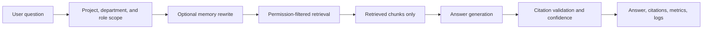

# Algorithm Guide

This folder explains how Enterprise Knowledge Agent answers a question, why the algorithm is shaped this way, and where the current implementation is strong or fragile.

The intended reader is a portfolio reviewer, recruiter-facing engineering manager, or developer who knows basic web apps but may be new to retrieval-augmented generation, vector search, prompt versions, or permission-filtered retrieval.

## Reading Order

1. [End-To-End Flow](end-to-end-flow.md): the full request lifecycle from user question to returned answer.
2. [Retrieval And Ranking](retrieval-and-ranking.md): how vector, keyword, hybrid, and reranked retrieval work.
3. [Permissions And Scope](permissions-and-scope.md): how project, department, and role filters prevent restricted evidence from reaching generation.
4. [Generation, Citations, And Confidence](generation-citations-confidence.md): how the model is prompted, how citations are validated, and how confidence is scored.
5. [Memory And Multi-Doc](memory-and-multi-doc.md): what conversation memory can influence, how multi-document mode works, and what remains limited.
6. [Evaluation Metrics](evaluation-metrics.md): what the benchmark, runners, dashboard exports, and metrics prove.
7. [Review Findings](review-findings.md): audit findings, risks, and recommended verification.

## Mental Model

At a high level, the system is:

The key safety design is that retrieval applies role and scope filtering before chunks are sent to the answer generator. Generation has a second defensive check and refuses if disallowed chunks somehow reach it.

## Glossary

| Term | Meaning in this project |
| --- | --- |
| RAG | Retrieval-augmented generation: first retrieve relevant document chunks, then ask the model to answer from those chunks. |
| Chunk | A smaller section of a document stored in Postgres and searched during retrieval. |
| Embedding | A numeric vector representing text meaning, created with the OpenAI embeddings API. |
| Vector search | Search by embedding similarity. |
| Keyword search | Search by text terms using PostgreSQL full-text search. |
| Hybrid search | Merge vector and keyword results with weighted normalized scores. |
| Reranking | Reordering an initial candidate set with an extra scoring rule. The current measured candidate uses lexical overlap plus vector score. |
| Citation | A structured pointer to a retrieved chunk: document ID, title, section, chunk ID, and support text. |
| Response type | A machine-readable answer category such as `answer`, `partial_answer`, `not_found`, `refuse_no_access`, or `clarify`. |
| Permission leakage | A restricted source appearing in retrieved chunks or citations for a role that should not access it. |
| Memory | Previous turns used to rewrite a follow-up question. It is not source evidence. |

## Current Measured Reference

The current strongest measured references come from existing artifacts:

| Area | Reference run | Sample | Result summary |
| --- | --- | ---: | --- |
| Retrieval | `phase33-vector-lexical-rerank-top3` | 130 | Precision@k `0.778`, expected-source recall `0.950`, MRR `0.965`. |
| Answer quality | `phase39-live-query-answer-quality-v8` | 130 | Answer accuracy `1.000`, citation accuracy `1.000`, hallucination rate `0.000`, 0 failed questions. |
| Permission safety | `phase46-permission-evaluation` | 20 restricted questions | Permission leakage `0.000`; unauthorized chunks reached generation `0.000`. |
| Memory | `phase36-memory-evaluation` | 20 follow-ups | Memory answer accuracy `1.000`, memory permission leakage `0.000`. |
| Generalization probes | `phase46-generalization-remediation` | 20 probes | Failed probes reduced from 12 to 0 while preserving zero memory-as-evidence violations. |

These are measured outputs over a synthetic benchmark, not production guarantees.

## Implementation Map

| Area | Main files |
| --- | --- |
| API request flow | `apps/api/app/main.py` |
| Retrieval dispatch | `apps/api/app/retrieval/retriever.py` |
| Vector retrieval | `apps/api/app/retrieval/vector_retriever.py` |
| Keyword retrieval | `apps/api/app/retrieval/keyword_retriever.py` |
| Hybrid retrieval | `apps/api/app/retrieval/hybrid_retriever.py` |
| Lexical reranking | `apps/api/app/retrieval/reranker.py` |
| Permissions | `apps/api/app/permissions` |
| Generation | `apps/api/app/generation/answer_generator.py` |
| Prompts | `apps/api/app/prompts/versions` |
| Citations | `apps/api/app/citations` |
| Confidence | `apps/api/app/confidence/confidence_scorer.py` |
| Memory | `apps/api/app/memory` |
| Multi-document behavior | `apps/api/app/reasoning` |
| Ingestion | `scripts/ingest_markdown.py`, `apps/api/app/ingestion` |
| Evaluation | `apps/api/app/evaluation`, `scripts/run_*_eval.py`, `scripts/export_dashboard_data.py` |

## What Is Implemented Versus Planned

| Capability | Status |
| --- | --- |
| Markdown corpus ingestion into Postgres and pgvector | Implemented. |
| PDF upload with deterministic text extraction and pending review | Implemented. |
| Approval and indexing for uploaded PDFs | Implemented for the local/Postgres workflow. |
| Project and department-scoped chat retrieval | Implemented when scope is supplied. |
| Role-filtered retrieval before generation | Implemented. |
| Production SSO and real enterprise connectors | Planned. |
| Multi-document decomposition | Implemented with heuristic detection, source planning, OpenAI query decomposition, and grouped evidence. |
| Evaluation dashboard | Implemented from existing evaluation artifacts. |
