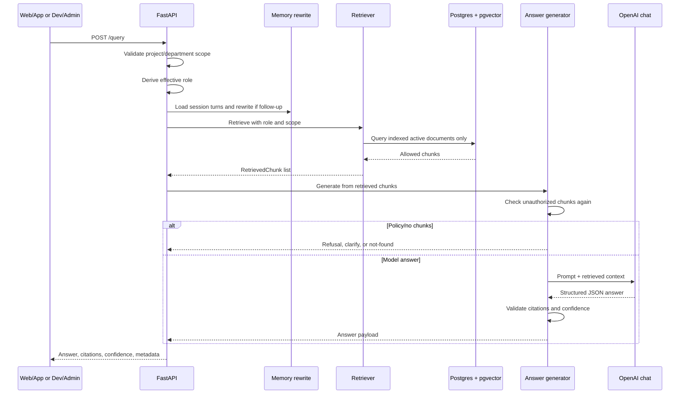

# End-To-End Flow

This document follows a user question through the live API path. The main entry points are `POST /query` and `POST /query/stream` in `apps/api/app/main.py`.

## One Request In Plain English

1. The API receives the question, requested retrieval settings, optional session ID, and optional project or department scope.
2. If a project scope is present, the API verifies the demo user is a member of that project.
3. The API chooses the effective role. For project-scoped App queries, it uses the signed-in demo user's business role instead of trusting the request body.
4. If a chat session exists, previous messages are loaded and used only to detect and rewrite follow-up questions.
5. Retrieval runs against Postgres with project, department, and role filters.
6. Multi-document mode may decompose the question into subqueries and merge results.
7. The answer generator receives only retrieved chunks that passed filtering.
8. Generation either returns a deterministic policy response, a no-access/not-found response, or calls OpenAI with a prompt version and retrieved context.
9. Citations are matched to retrieved chunks, optionally backfilled from retrieved chunks, then validated.
10. Confidence scores, citations, retrieved chunk previews, memory metadata, and permission checks are returned.
11. The request is logged for observability. Permission-filtered retrieval is audit logged.

## Request Flow Diagram

## Scope And Role Selection

The request schema allows:

| Field | Meaning |
| --- | --- |
| `project_id` | Optional project boundary for App-side scoped RAG. |
| `department_id` | Optional strict department boundary. It requires `project_id`. |
| `user_role` | Requested role. It is honored for admin/global use more than App-scoped use. |
| `retrieval_mode` | `vector_only`, `keyword_only`, `hybrid`, or `vector_lexical_rerank`. |
| `top_k` | Number of final chunks requested. |
| `multi_doc_mode` | `auto`, `off`, or `force`. |
| `prompt_version` | Optional prompt override. |

In App-scoped requests, `apps/api/app/main.py` calls project membership checks before retrieval and derives the role from the authenticated demo user. Department scope is strict: if supplied, retrievers add `d.department_id = %s::uuid`.

## Memory Step

Memory is not evidence. It is a preprocessing aid:

1. `list_messages` loads recent session messages.
2. `rewrite_followup_question` checks whether the current question looks like a follow-up.
3. If it is a follow-up, the system creates a standalone retrieval question.
4. `memory_context_text` provides a small prompt note with previous topic and cited source IDs.
5. The answer must still cite currently retrieved chunks.

This is why prior assistant answers can help resolve "it" or "that", but they are not trusted as proof.

## Retrieval Step

The normal dispatch lives in `apps/api/app/retrieval/retriever.py`.

| Mode | Implementation |
| --- | --- |
| `vector_only` | Embeds the query, searches `chunk_embeddings`, returns nearest chunks. |
| `keyword_only` | Builds a PostgreSQL full-text query and ranks by `ts_rank_cd`. |
| `hybrid` | Runs vector and keyword retrieval separately, normalizes scores, merges, and sorts. |
| `vector_lexical_rerank` | Runs vector retrieval over a larger allowed candidate set, then reranks by vector score plus lexical overlap. |

Every retriever filters by:

- document status `active`
- document version status `indexed`
- chunking strategy
- project and department scope, when supplied
- role overlap via `d.access_roles && %s`

## Generation Step

The answer generator first checks for unsafe state:

- If any retrieved chunk is not accessible to the current role, it returns `refuse_no_access` and logs an audit event.
- If no chunks exist, it returns `not_found` unless the expected behavior explicitly asks for no-access.
- If deterministic policy patterns match, it can return `not_found`, `refuse_no_access`, `clarify`, or a direct supported answer without calling OpenAI.
- Otherwise, it builds a prompt from the selected prompt version and the retrieved context.

The default active prompt is chosen by `get_prompt("answer_generation", version)`. If no version is supplied, the active prompt file is used. Phase 38's strongest answer-quality run explicitly used prompt `v8`.

## Response Payload

The API response includes:

| Field | Purpose |
| --- | --- |
| `answer` | Natural-language answer. |
| `response_type` | Structured type: `answer`, `partial_answer`, `not_found`, `refuse_no_access`, or `clarify`. |
| `behavior` | Evaluation behavior derived from response type. |
| `citations` | Validated citations pointing to retrieved chunks. |
| `retrieved_chunks` | Chunk metadata and content previews, not full chunk text. |
| `memory` | Follow-up detection and rewrite metadata. |
| `permission_check` | Effective role and whether unauthorized chunks reached generation. |
| `confidence` fields | Retrieval, citation, answer, and final confidence. |
| `scope` | Project and department scope used by retrieval. |

## Important Boundary

The answer generator's context comes from `RetrievedChunk` objects returned by the retriever. That means the main permission boundary is before generation, not after generation.

The code also logs retrieved chunk IDs and document IDs for observability, but it does not need to log full source text to prove which evidence was used.
