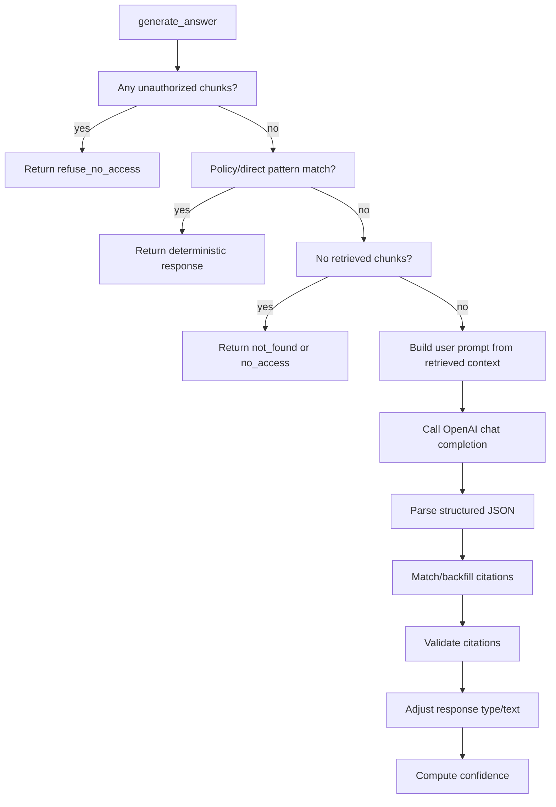

# Generation, Citations, And Confidence

Generation is the step that turns retrieved chunks into an answer. The answer generator is intentionally structured: it chooses a response type, asks the model for JSON when needed, validates citations, and computes confidence.

## Response Types

The system uses these response types from `apps/api/app/generation/response_types.py`:

| Response type | Meaning | Evaluation behavior |
| --- | --- | --- |
| `answer` | The context supports the answer. | `answer` |
| `partial_answer` | Some supported answer exists, but evidence is incomplete. | `answer` |
| `not_found` | Accessible documents do not contain the requested information. | `say_not_found` |
| `refuse_no_access` | The user lacks access to the required information. | `refuse_no_access` |
| `clarify` | The user needs to specify context before the system can answer safely. | `ask_clarifying_question` |

## Generation Decision Tree

## Prompt Versions

Prompt files live under `apps/api/app/prompts/versions`.

Each prompt has YAML frontmatter with:

- prompt ID and name
- version
- status
- model
- temperature
- created date
- change notes

`get_prompt` selects the requested version if supplied. Otherwise, it selects the most recent prompt whose status is `active`, or the newest prompt if none is active.

The current strongest measured answer-quality run used the live `/query` path with `answer_generation:v8` behavior:

- Run ID: `phase39-live-query-answer-quality-v8`
- Prompt version: `v8`
- Model: `gpt-4.1-mini`
- Temperature: `0`

## Deterministic Policy Responses

Before calling OpenAI, `answer_generator.py` checks pattern lists:

| Pattern list | Result |
| --- | --- |
| `MISSING_PATTERNS` | Return `not_found`. |
| `RESTRICTED_PATTERNS` | Return `refuse_no_access` if role is not allowed. |
| `AMBIGUOUS_PATTERNS` | Return `clarify`. |
| `ADVERSARIAL_SOURCE_PATTERNS` | Return a source-grounded answer explaining not to follow malicious source text. |
| Direct supported responses | Return exact evidence-backed answers for several high-confidence cases. |

These rules helped Phase 38 and Phase 39 reduce measured failures without changing benchmark expectations. They are also the most hand-tuned part of generation.

## Prompt Context

The user prompt includes:

- original user question, when different from the rewritten retrieval question
- standalone retrieval question
- conversation memory text for clarification only
- retrieved context blocks

Each retrieved context block includes:

- document ID
- document title
- section heading
- chunk ID
- rank
- retrieval score
- content

Multi-document prompts group chunks by document.

## Structured Answer Contract

Prompt versions ask the model to return JSON with:

- `response_type`
- `answer`
- `citations`
- `supported_claims`
- `unsupported_claims`
- `validation_notes`

If the model does not return valid JSON, the generator falls back to parsing plain text and records an unsupported-claim note.

## Citation Matching

Citations are accepted only if they match retrieved chunks.

The generator matches model citations by:

1. `chunk_id`, if present.
2. Otherwise document ID plus section heading.

If a model citation cannot be matched to a retrieved chunk, it is dropped before validation.

## Citation Backfill

For `answer` and `partial_answer`, the system can add missing citations from retrieved chunks. Backfill:

- uses only retrieved chunks
- checks overlap between answer text and chunk content
- requires minimum confidence and overlap thresholds
- prefers citations that add a new document
- adds at most 3 citations

This improves citation coverage, but it is heuristic. It can help when the model answered from available context but omitted a needed citation.

## Citation Validation

`apps/api/app/citations/citation_validator.py` computes citation support by combining:

- term overlap between answer claims and evidence
- rank score
- retrieval score

It returns:

- validated citations
- citation confidence
- supported claim labels
- unsupported claim labels
- validation note

Important limitation: this is not a semantic proof system. It is a deterministic support heuristic.

## Response Adjustment

After validation, `_adjust_response_type` can downgrade weak answers:

| Condition | Result |
| --- | --- |
| Answer or partial answer with very low citation confidence | `not_found` |
| Answer with weaker support or unsupported claims | `partial_answer` |
| Multi-doc answer | Uses lower thresholds than single-doc mode. |

If downgraded to `not_found`, citations and unsupported claims are cleared.

## Confidence Scoring

`apps/api/app/confidence/confidence_scorer.py` produces:

| Score | Inputs |
| --- | --- |
| Retrieval confidence | Top score, rank bonus, and diversity of top documents. |
| Citation confidence | Average support confidence from citation validation. |
| Answer confidence | Citation confidence with unsupported-claim penalty, or baseline confidence for no-access/not-found/clarify. |
| Final confidence | Weighted combination of retrieval, citation, and answer confidence. |

For answers, final confidence weights citation support heavily. For `not_found`, `refuse_no_access`, and `clarify`, it weights answer confidence and retrieval confidence.

The API also returns `confidence_interpretation`. For `answer` and `partial_answer`, it is `answer_support`; for `not_found`, `refuse_no_access`, and `clarify`, it is `response_behavior`. This label is meant to prevent reading non-answer confidence as factual-answer certainty.

## Hallucination Control

The system controls unsupported answers through several layers:

- prompt instructions requiring answer-from-context only
- deterministic missing-information patterns
- citation validation
- response downgrades when citation confidence is low
- evaluation flag when unsupported claims exist or citation confidence is below `0.5`

The latest live `/query` answer-quality scorecard run reported hallucination rate `0.000` over 130 questions. That means the deterministic evaluator did not flag hallucination under its rules; it does not mean production hallucination is impossible.

## Current Answer-Quality Evidence

| Run | Sample | Answer accuracy | Citation accuracy | Hallucination rate | Failed questions |
| --- | ---: | ---: | ---: | ---: | ---: |
| `phase32-expanded-answer-generation-v5` | 130 | `0.850` | `0.844` | `0.205` | 43 |
| `phase35-citation-alignment-v7` | 130 | `0.919` | `0.950` | `0.000` | 16 |
| `phase38-answer-quality-remediation-v8` | 130 | `0.975` | `0.969` | `0.000` | 6 |
| `phase39-live-query-answer-quality-v8` | 130 | `1.000` | `1.000` | `0.000` | 0 |

The current live scorecard has `0` failed benchmark questions. Diagnostic submetric notes remain visible separately from failed answers, especially for memory response-type comparability and one clarification source-coverage diagnostic.
