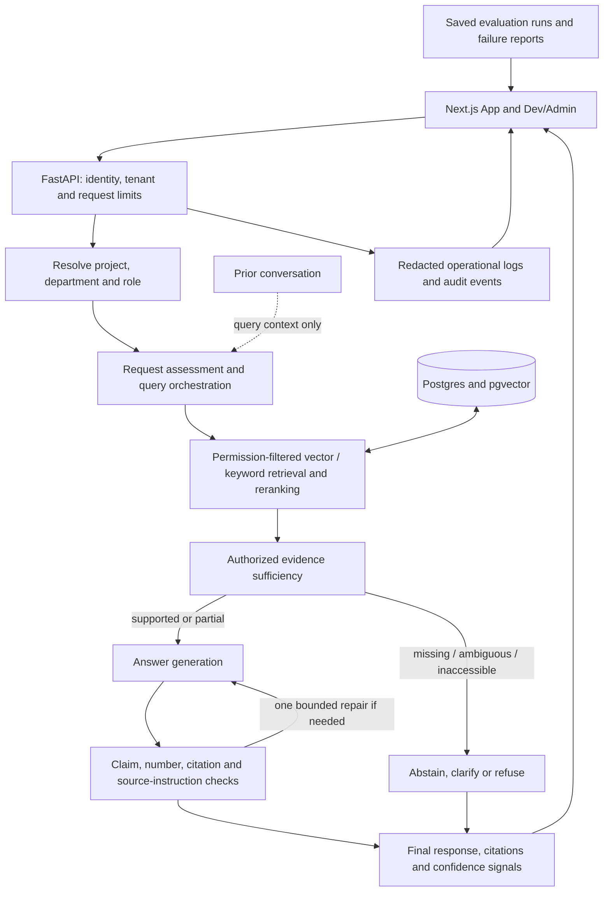
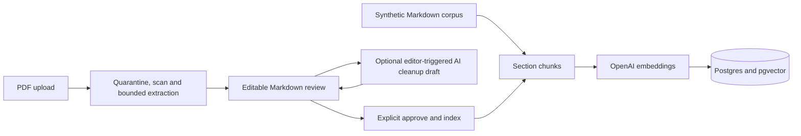

# Proofbase architecture

Proofbase answers questions from authorized document passages. The model supplies language and reasoning; it does not decide which tenant, role, project or document a user may access.

## Knowledge enters through review

Uploading or generating a cleanup draft does not make content searchable. Indexing is a separate action. Original sources and review state remain inspectable. The local parser and fixture scanner have documented production limits.

## Follow one request

1. The API resolves identity and authorization independently of the language model. Local demo mode maps the selected seeded user to a server-side role; production identity integration is a separate boundary.
2. Memory may clarify a follow-up's subject. It is never cited as evidence. Request assessment chooses an answer, clarification or refusal route without granting access.
3. Retrieval filters tenant, project, department and role before passages reach generation. Vector and keyword candidates can be combined and reranked; multi-document requests may issue several searches.
4. The evidence gate asks whether the authorized passages support the requested answer. A topic keyword alone must not override a positive evidence decision with “not found.”
5. Generation receives authorized passages. Claim and citation validation may accept, attempt one repair, or downgrade. Numeric policy claims are checked against source content; an authorized ID in a `Source:` annotation is citation metadata.
6. The UI replaces streamed draft text with the final validated response and shows its proof. Confidence combines support signals; it is not a calibrated probability. Logs and saved evaluation reports help inspect behavior but do not guarantee correctness.

## Code map

| Responsibility | Entry point |
| --- | --- |
| API orchestration | `apps/api/app/main.py` |
| Identity and access | `apps/api/app/auth`, `apps/api/app/permissions` |
| Retrieval and ranking | `apps/api/app/retrieval` |
| Request/evidence/claim checks | `apps/api/app/reasoning` |
| Generation and repair | `apps/api/app/generation/answer_generator.py` |
| Upload and indexing | `apps/api/app/ingestion`, `apps/api/app/files` |
| Chat and proof UI | `apps/web/app/chat/ChatDemoClient.tsx` |
| Measured evidence | `data/evaluation`, `docs/phase-65`, `docs/phase-68` |

## What this architecture does not prove

The system can still omit facts, select incomplete evidence, abstain unnecessarily, or make mistakes that its validator misses. Historical evaluation artifacts describe their frozen runtimes, not an accuracy guarantee for later changes. Local OIDC fixtures, scanner contracts and self-review do not establish production SSO, independent penetration testing or production readiness. See the [evaluation guide](../evaluation/README.md) and [deeper algorithm documentation](../algorithm/README.md).
