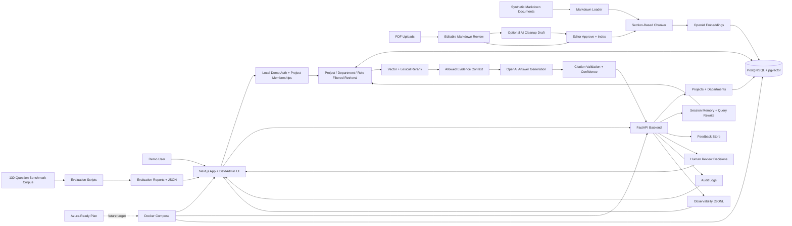

# Architecture Diagram Guidance

## What The Diagram Should Show

The architecture diagram should make it clear that this is an evaluated enterprise RAG system, not only a chat completion wrapper.

Include:

- Next.js App and Dev/Admin UI.
- FastAPI backend.
- PostgreSQL with pgvector.
- Markdown ingestion pipeline.
- Project workspaces and department document libraries.
- PDF-to-Markdown review uploads.
- Section-based chunking.
- OpenAI embeddings.
- Vector, keyword, hybrid, and vector + lexical rerank retrieval.
- Role-based permission filtering before generation.
- Answer generation.
- Citation validation and confidence scoring.
- Session memory and query rewriting.
- Evaluation runner and 130-question benchmark data.
- Feedback, human review, observability, and audit logs.
- Docker Compose local stack.
- Azure-ready deployment targets.

## Mermaid Diagram

## Diagram Notes

- Put project, department, and role filtering before generation.
- Show uploaded PDFs as reviewable and approval-gated before indexing.
- Show evaluation scripts as first-class parts of the system.
- Show observability and audit as operational outputs.
- Label Azure as a readiness plan or future deployment target, not as completed deployment.
- Keep raw document storage as repository files today; Azure Blob Storage is future work.

## Suggested Caption

> Proofbase uses a FastAPI RAG backend, PostgreSQL/pgvector retrieval, role-based permission filtering, OpenAI generation, citation validation, and a Next.js App plus Dev/Admin UI. The system has a 130-question benchmark corpus with current benchmark v1.1 retrieval and answer-quality runs plus separate permission and memory suites, then is packaged with Docker for local demos and Azure-ready deployment planning.
