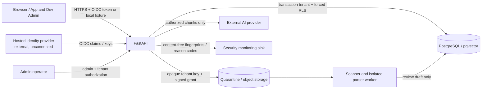

# Phase 62 Threat Model And Data Flow

Status: internally reviewed portfolio preparation. **Independent validation required**.

## System and data flow

Hosted identity, object storage, scanner/worker, monitoring, and managed-secret destinations are provider boundaries, not connected production services. Local fixtures exercise their contracts.

## Assets

- tenant identity, memberships, session/revocation state, and admin authority
- source originals, extracted/reviewed text, embeddings, chunks, citations, and access roles
- prompts and conversation context, which are request data and never evidence
- credentials, signing keys, provider tokens, and database/cache connection strings
- audit/security event integrity, evaluation provenance, release decisions, and sealed-holdout hashes
- service availability and external-AI cost budget

## Trust boundaries

1. Browser to API: all headers, body content, IDs, and role requests are untrusted.
2. Identity provider to API: signatures, issuer, audience, expiry, revocation, and selected-tenant claims must validate; claims never bypass database authorization.
3. API to PostgreSQL: transaction-local tenant/user context and forced RLS protect rows even when application filters are absent.
4. Upload to quarantine/worker: bytes remain untrusted through envelope, scan, parse, review, and approval; rejected or pending files never enter retrieval.
5. API to external AI: only permission-filtered evidence and bounded request context may cross; model output cannot grant scope or execute source instructions.
6. Runtime to security monitoring: only content-free events cross; the local sink is runtime-rewritable and therefore not an immutable production boundary.
7. Admin routes: tenant owner/admin authorization is required; platform evaluation artifacts remain separate from tenant-owned content.

## Principal abuse cases and controls

| Abuse case | Primary controls | Residual risk / required evidence |
| --- | --- | --- |
| stolen or forged identity | OIDC validation contract, expiry/revocation, offboarding, auth rate limit | hosted provider/session end-to-end test |
| tenant-ID or object-ID substitution | selected-tenant claim check, tenant-aware relationships, forced RLS, generic denial | independent multi-tenant assessment |
| role or scope escalation through model text | immutable application scope, pre-generation filtering, RLS | independent authorization and prompt-attack testing |
| direct/indirect prompt injection | deterministic/semantic request assessment, source-as-data prompt, evidence and post-generation validation | novel attack generalization and human review |
| poisoned or malicious file | quarantine, strict PDF envelope, scan contract, bounded parser, approval before index | hosted scanner/worker and format-specific assessment |
| secret exfiltration | mounted-secret boundary, redaction, build/image scan, content-free monitoring | managed provider and operational rotation drill |
| log or alert exfiltration | identifier fingerprints, metadata allowlist, tenant-scoped admin read | external sink access/retention review |
| denial of service or cost abuse | size limits, distributed operation limits, concurrency leases, AI admission budget | hosted proxy/cache/provider reconciliation |
| dependency/build compromise | lock inventory, secret scan, non-root images, build-context exclusions | current CVE/SBOM/signature tooling |
| sealed evaluation leakage or tuning | separate development/release data, hashes, no routine execution | independent suite custody and release witness |

## Assumptions and exclusions

- Only synthetic, non-sensitive business content is in scope; real regulated or personal data is prohibited.
- PDF is the only accepted format, bounded at 10 MB and 100 pages.
- Azure deployment is optional and absent. No paid service or Marketplace dependency is assumed.
- Local demo identity, fixture scanner, subprocess parser, JSONL monitoring, and self-review cannot establish production or independent-security claims.
- The Phase 47-49 sealed holdouts and Phase 55 sealed holdout remain immutable and are not development test material.
